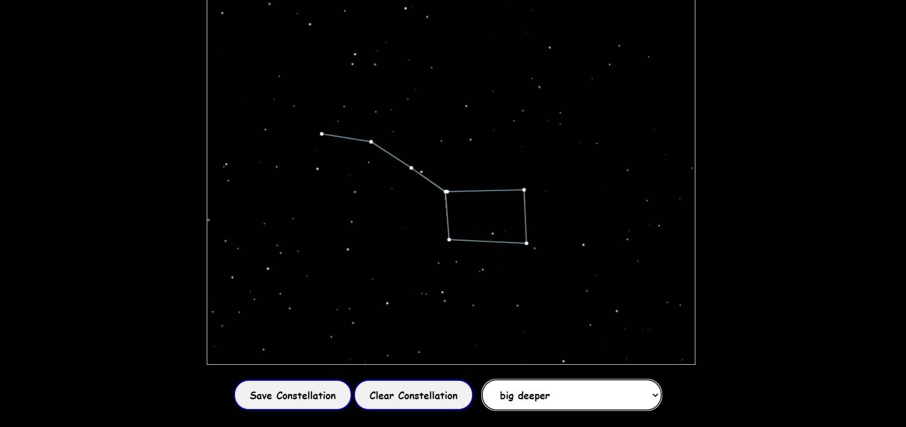

# Interactive Constellation Map 🌌

An engaging, interactive constellation map built with HTML5 Canvas and JavaScript! Explore the night sky, create and save your own constellations, and watch as stars twinkle and shooting stars streak across the screen.

## 🌠 Demo

  
  
*Screenshot of the Interactive Constellation Map*

## 🚀 Features

- **Interactive Star Generation**: Click on the canvas to create stars.
- **Connect Stars**: Click to connect stars and form your own constellations.
- **Save and Name Constellations**: Save custom constellations with unique names.
- **View Saved Constellations**: Select and view saved constellations on the map.
- **Clear and Reset**: Clear the current constellation for a fresh start.
- **Atmospheric Effects**: Watch stars twinkle and shooting stars streak across the sky for an immersive experience.

## 🛠️ Tech Stack

-  **HTML5 Canvas** for interactive graphics
- [JavaScript](https://img.shields.io/badge/JavaScript-ES6-yellow?logo=javascript) **JavaScript** for drawing, animations, and user interactions!
-  **CSS** for layout and basic styling


## 📖 Getting Started

Follow these instructions to get a copy of the project up and running on your local machine.

### Prerequisites

All you need is a modern web browser.

### Installation

1. **Clone the repository**:
   ```bash
   git clone https://github.com/yourusername/interactive-constellation-map.git
   ```
   
2. **Navigate to the project folder**:
   ```bash
   cd interactive-constellation-map
   ```

3. **Open the HTML file**:
   Simply open `index.html` in your browser to start exploring the night sky!

### Usage

- **Click** anywhere on the canvas to add stars.
- **Connect** stars by clicking on different points in succession.
- **Save your constellation** by clicking the "Save Constellation" button and entering a name.
- **View saved constellations** by selecting from the dropdown list.
- **Clear** the current constellation with the "Clear Constellation" button to create a new one.

## 🎥 Demo Video

[Watch the Demo Video](link-to-demo-video)  

## 🌌 Screenshots

  
*Creating and connecting stars to form a constellation*

  
*Saved constellations dropdown*

## 🎨 Customization

You can customize the following in `constellationCanvas.js`:

- **Star density** by modifying the number of stars generated in the `stars` array.
- **Animation speed** of twinkling or shooting stars.

## 📋 Contributing

Contributions are what make the open-source community such a great place to learn, inspire, and create. If you'd like to contribute, please fork the repository and create a pull request with detailed information about the changes.

1. Fork the Project
2. Create your Feature Branch (`git checkout -b feature/AmazingFeature`)
3. Commit your Changes (`git commit -m 'Add some AmazingFeature'`)
4. Push to the Branch (`git push origin feature/AmazingFeature`)
5. Open a Pull Request


## 📬 Contact

Created by [Srijan Paul](https://github.com/paul-srijan)  
Email: iampaulsrijan@gmail.com

## Connect with Me

Feel free to connect with me on my other platforms for updates, queries, or collaborations!


- **GitHub**: [paul-srijan](https://github.com/paul-srijan)
- **LinkedIn**: [Srijan Paul](https://www.linkedin.com/in/srijan-paul-547354260/)
- **Email**: iampaulsrijan@gmail.com
- **twitter**:[Paul Srijan](https://x.com/iampaulsrijan)

---

Happy stargazing! 🌌✨


